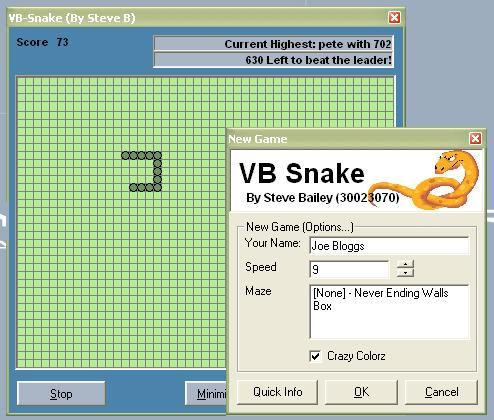



## VB\-Snake

### Description

Yes finally a great implimentation of a replica snake game!!! includes bonus points, and also custom mazes!!! does not use dx or bitblt!!!! plz vote
 
### More Info
 

             |
---                |---
**Submitted On**   |2003-09-22 06:51:54
**By**             |[Aimee Bailey](https://github.com/Planet-Source-Code/PSCIndex/blob/master/ByAuthor/aimee-bailey.md)
**Level**          |Intermediate
**User Rating**    |4.8 (19 globes from 4 users)
**Compatibility**  |VB 6\.0
**Category**       |[Games](https://github.com/Planet-Source-Code/PSCIndex/blob/master/ByCategory/games__1-38.md)
**World**          |[Visual Basic](https://github.com/Planet-Source-Code/PSCIndex/blob/master/ByWorld/visual-basic.md)
**Archive File**   |[VB\-Snake1648649222003\.zip](https://github.com/Planet-Source-Code/aimee-bailey-vb-snake__1-48697/archive/master.zip)

